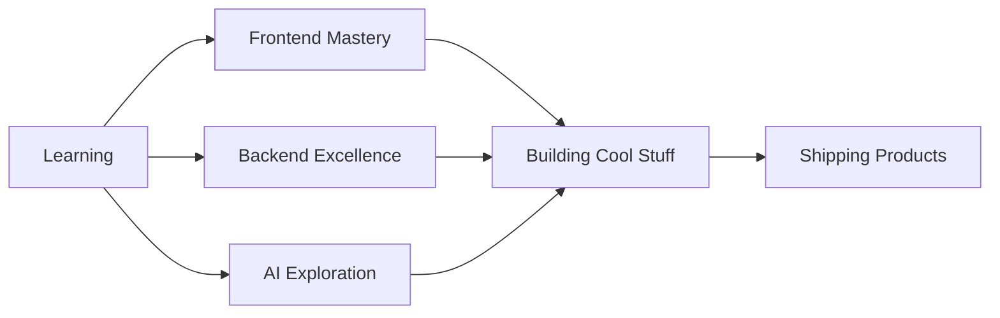

# Hi there!  

I’m Daniel Jesuloba Ajide, a full stack software engineer.  

I enjoy building scalable web and mobile applications, and I’m deeply interested in how AI can be applied to healthcare, businesses, and smart cities.  
Right now, I’m spending a lot of time exploring frontend web design, sharpening my backend skills, and gradually peeking into AI systems.  

Outside of coding, you’ll find me playing chess, making music, gaming, or reading.  

Fun Facts:  
- I prefer simplicity in design and code.  
- I enjoy finding ways to integrate AI into everyday life.  


<div align="center">

# 👋 Daniel Jesuloba Ajide

### Full Stack Software Engineer | AI Enthusiast | Builder


</div>

---

## 🚀 About Me

I'm passionate about creating **scalable, user-centric applications** that solve real-world problems. My work sits at the intersection of full stack development and artificial intelligence, with a special focus on:

- 🏥 **Healthcare AI** – Making medical solutions more accessible
- 🏙️ **Smart Cities** – Building intelligent urban infrastructure
- 💼 **Business Solutions** – Streamlining operations through technology

Currently diving deep into **frontend design patterns**, leveling up my **backend architecture**, and exploring the fascinating world of **AI systems**.

---

## 💻 Tech Stack & Tools

```javascript
const daniel = {
    location: "Building the future, one commit at a time",
    focus: ["Full Stack Development", "Mobile Apps", "AI Integration"],
    currentlyLearning: ["Advanced Frontend Patterns", "Backend Scalability", "AI/ML Systems"],
    askMeAbout: ["Web Dev", "Mobile Apps", "AI Applications", "System Design"],
    funFact: "I believe the best code is the code you don't have to write"
};
```

<div align="center">


</div>

---

## 🎯 What I'm Up To



---

## 🌟 Philosophy

> **"Simplicity is the ultimate sophistication."**  
> I believe in writing clean, maintainable code and thoughtfully integrating AI into everyday life.

### Core Principles

🎨 **Design** – Less is more. Clean interfaces, intuitive experiences  
⚡ **Performance** – Fast, efficient, scalable solutions  
🤖 **AI Integration** – Smart automation that enhances, not complicates  
📚 **Continuous Learning** – Technology evolves, so do I  

---

## 🎮 Beyond the Code

When I'm not crafting digital solutions, you'll find me:

<table>
<tr>
<td width="25%" align="center">♟️<br/><b>Playing Chess</b><br/>Strategy & Critical Thinking</td>
<td width="25%" align="center">🎵<br/><b>Making Music</b><br/>Creative Expression</td>
<td width="25%" align="center">🎮<br/><b>Gaming</b><br/>Exploration & Fun</td>
<td width="25%" align="center">📚<br/><b>Reading</b><br/>Continuous Learning</td>
</tr>
</table>

---

## 📊 GitHub Stats

<div align="center">


</div>

---

## 🤝 Let's Connect

<div align="center">

[](YOUR_PORTFOLIO_URL)
[](YOUR_LINKEDIN_URL)
[](YOUR_TWITTER_URL)
[](mailto:YOUR_EMAIL)

</div>

---

<div align="center">

### 💡 Open to collaborations and interesting projects!

**"Building the future, one commit at a time."**


</div>